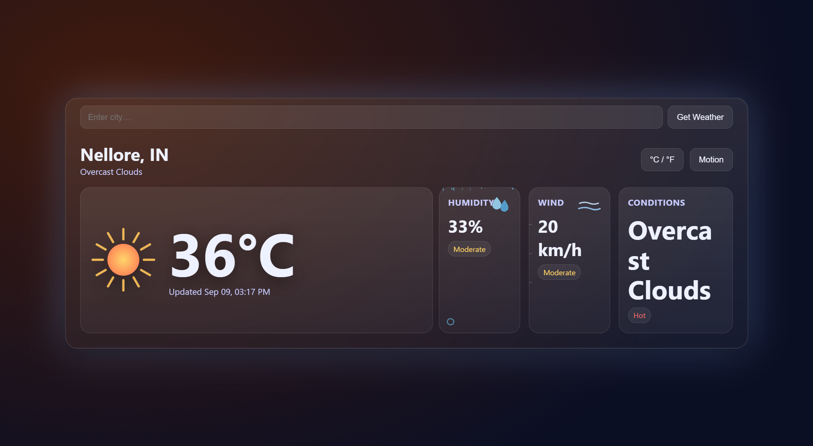

# 🌤️ Django Weather App

A small Django app that shows current weather for a city using the OpenWeather API — wrapped in a sleek, animated UI (glassmorphism, responsive layout, C/°F toggle, reduced-motion toggle, and dynamic icons for temperature, humidity and wind).

---

## Features

- 🔆 Animated, responsive weather card (no external JS/CSS libs)
- 🌡️ Auto-theme based on temperature (hot/mild/cold)
- 💧 Humidity & 🌬️ wind panels with status badges and animations
- 🔁 °C/°F toggle + reduced-motion toggle for accessibility
- 🧩 Safe Django → JS data bridge using `json_script` (no `tojson`)

---

## Tech stack

- Python 3.11+ (tested with 3.12)
- Django 5.x
- `requests` for HTTP calls
- `python-dotenv` to load `.env` in development

---
